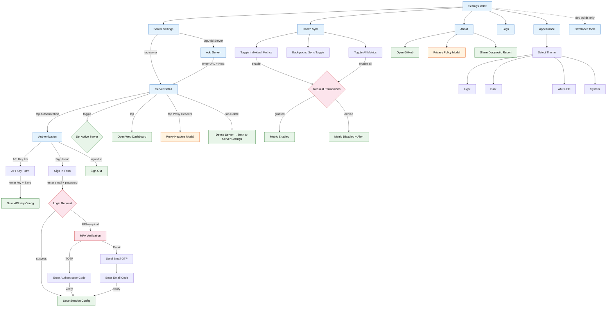

# Settings Tab — User Flows

## Navigation Overview

## Flow Descriptions

### Server Management

1. **Add Server**: Settings Index → Server Settings → Add Server → enter URL → Next → Server Detail (new server created with URL only)
2. **Configure Auth**: Server Detail → Authentication → choose Sign In or API Key tab → complete form → config saved
3. **Sign In with MFA**: Authentication → enter credentials → MFA required → enter TOTP code or request email OTP → verify → session saved
4. **Set Active Server**: Server Detail → toggle "Use This Server" switch
5. **Configure Proxy Headers**: Server Detail → Proxy Headers → modal to add/edit/remove custom HTTP headers
6. **Delete Server**: Server Detail → Delete Server → confirmation alert → returns to Server Settings

### Health Sync

1. **Enable Metric**: Health Sync → toggle metric → permission request → granted → metric enabled with background delivery
2. **Enable All**: Health Sync → toggle "Enable All" → bulk permission request → all metrics enabled
3. **Background Sync**: Health Sync → toggle background sync → (Android: request background access permission) → configure/stop background task

### Appearance

1. **Change Theme**: Appearance → tap theme option (Light / Dark / AMOLED / System) → saved to AsyncStorage

### About

1. **View Privacy Policy**: About → tap Privacy Policy → modal displayed
2. **Share Diagnostics**: About → tap Share Diagnostic Report → exports app version, sync status, and logs
